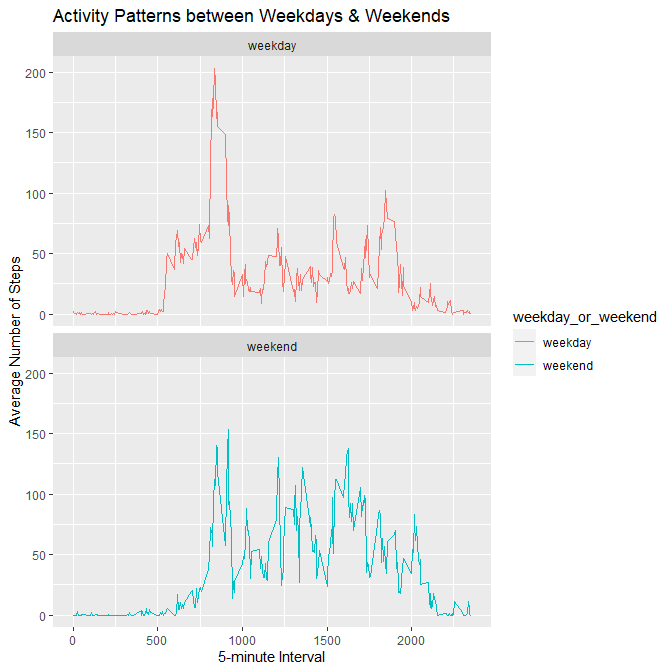

## Introduction  
This assignment makes use of data from a personal activity monitoring device.
This device collects data at 5 minute intervals through out the day. The data 
consists of two months of data from an anonymous individual collected during the 
months of October and November, 2012 and include the number of steps taken in 
5 minute intervals each day.

## Information regarding dataset
The data for this assignment can be downloaded from the course web site:  
  
* Dataset size [52k]: [Activity monitoring data](https://d396qusza40orc.cloudfront.net/repdata%2Fdata%2Factivity.zip)  
  
* The variables included in this dataset are:  
  * steps: Number of steps taking in a 5-minute interval (missing values are coded as )
  * date: The date on which the measurement was taken in YYYY-MM-DD format
  * interval: Identifier for the 5-minute interval in which measurement was taken  


## Loading and preprocessing the data
In this project, the following assumptions are made:  
1. Packages *"ggplot2", dplyr", "data.table"* are already installed
2. Data archive file *activity.zip* is already downloaded and present in CWD

In this section the following steps are executed: 
1. unzip **activity.zip** and load **activity.csv** file
2. Process/transform the data (if necessary) into a format suitable for your analysis 


  
1. unpack 'activity.zip' and load 'activity.csv'  
2. Load data as two Data Frames  

```r
zipFile <- "https://d396qusza40orc.cloudfront.net/repdata%2Fdata%2Factivity.zip"
zipFileName <- "activity.zip"
if (!file.exists(zipFileName)){
  download.file(zipFile, zipFileName, mode = "wb")
}

unzip(zipFileName, exdir = getwd())

csv_file <- read.csv2(file="activity.csv", sep="," , header=TRUE)
csv_file1 <- read.csv2(file="activity.csv", sep="," , header=TRUE)
setDT(csv_file)
setDT(csv_file1)
```
## What is mean total number of steps taken per day?
In this part of the section, we ignore the missing values in the dataset.  
1. Calculate the total number of steps taken per day


```r
## Step 1: Convert 'date' from 'character' to 'Date'
csv_file$date <- as.Date(csv_file$date, format="%Y-%m-%d")

## Step 2: Group by date to create plot and add steps taken in a day
plot_steps <- csv_file %>% group_by(date) %>% summarize(steps = sum(steps))
```
  
2. Plot a histogram of the total number of steps taken each day   

```r
ggplot(plot_steps, aes(x = steps)) + geom_histogram(fill = "blue", binwidth = 1000) + labs(title = "Steps taken in a Day", x = "Steps")
```

```
## Warning: Removed 8 rows containing non-finite values (stat_bin).
```

<!-- -->
 
3. Calculate and report the mean and median of the total number of steps taken per day   

```r
mean_steps <- mean(plot_steps$steps, na.rm=TRUE)
median_steps <- median(plot_steps$steps, na.rm=TRUE)
```
  
Mean 1.0766189\times 10^{4} number of total number of steps taken per day
Median 10765 number of total number of steps taken per day  


## What is the average daily activity pattern?
In this part of the section, code executes the following steps: 
1. Make a time series plot (i.e. ) of the 5-minute interval (x-axis) and the average
number of steps taken, averaged across all days (y-axis)  
 

```r
stepsByInterval <- csv_file1 %>% group_by(interval) %>% summarize(steps = mean(steps, na.rm=TRUE))

# filter the stepsByInterval where steps is maximum
maxRow <- stepsByInterval[which.max(stepsByInterval$steps),]

titlelab <- "Activity Patterns across all days"
ylab <- "Average Number of Steps"
xlab <- "5-minute Interval"

g <- ggplot(stepsByInterval, aes(x=interval, y=steps)) +geom_line(color="blue", size=1) 
g + labs(x = xlab) + labs(y = ylab) + labs(title = titlelab)
```

<!-- -->
  
2. Which 5-minute interval, on average across all the days in the dataset, contains the  
maximum number of steps?  
Maximum Number of Steps 206.1698113    
Interval that contains the maximum number of steps: 835  


## Imputing missing values
In this part of the section, code executes the following steps:  
  
1. Calculate and report the total number of missing values in the dataset (i.e. the total number of rows with NA)  

```r
num_of_NAs_in_rows <- apply(csv_file1, 1, function(x){any(is.na(x))})
```
  
Total number of missing values in the dataset: 2304  
  
2. Devise a strategy for filling in all of the missing values in the dataset. The strategy does not need to be sophisticated. For example, you could use the mean/median for that day, or the mean for that 5-minute interval, etc.  
3. Create a new dataset that is equal to the original dataset but with the missing data filled in.  

```r
## Filling missing values in 'stpes' with median of 'steps'
## new dataset 'csv_file1' created

csv_file1$steps[is.na(csv_file1$steps)] <- median(csv_file1$steps, na.rm=TRUE)

## Step 1: Convert 'date' from 'character' to 'Date'
csv_file1$date <- as.Date(csv_file1$date, format="%Y-%m-%d")

## Step 2: Group by date to create plot and add steps taken in a day
plot_steps <- csv_file1 %>% group_by(date) %>% summarize(steps = sum(steps))
```
  
4. Make a histogram of the total number of steps taken each day and Calculate and report  
the mean and median total number of steps taken per day  

```r
ggplot(plot_steps, aes(x = steps)) + geom_histogram(fill = "blue", binwidth = 1000) + labs(title = "Steps taken in a Day", x = "Steps")
```

<!-- -->
  
Do these values differ from the estimates from the first part of the assignment? 
* **YES**  
What is the impact of imputing missing data on the estimates of the total daily number of steps?  
* The value at 'interval' 0 - **Number of Steps taken is 4 times higher**   


## Are there differences in activity patterns between weekdays and weekends?
In this part of the section, code executes the following steps:   
  
1. Create a new factor variable in the dataset with two levels – “weekday” and “weekend
indicating whether a given date is a weekday or weekend day.  

```r
## Add DayofWeek column
csv_file1 <- mutate(csv_file1, DayofWeek = weekdays(csv_file1$date))

## Function to add 'weekday_or_weekend column to plot
## credit: https://stackoverflow.com/questions/38649533/case-when-in-mutate-pipe
## credit: https://www.statology.org/conditional-mutating-r/
set_weekdays_weekend <- function(df) {
    df %>% mutate(weekday_or_weekend = case_when(
        DayofWeek == "Monday" ~ "weekday",
        DayofWeek == "Tuesday" ~ "weekday",
        DayofWeek == "Wednesday" ~ "weekday",
        DayofWeek == "Thursday" ~ "weekday",
        DayofWeek == "Friday" ~ "weekday",
        DayofWeek == "Saturday" ~ "weekend",
        DayofWeek == "Sunday" ~ "weekend",
    ))
}

## Add two more columns -- weekend and weekday
csv_file1 <- set_weekdays_weekend(csv_file1)

plot_weekend_weekday <- csv_file1 %>% group_by(interval, weekday_or_weekend) %>% summarize(steps = mean(steps))
```

```
## `summarise()` has grouped output by 'interval'. You can override using the `.groups` argument.
```
  
2. Panel plot containing a time series plot (i.e. ) of the 5-minute interval (xaxis)
and the average number of steps taken, averaged across all weekday days or
weekend days (y-axis).  


```r
titlelab <- "Activity Patterns between Weekdays & Weekends"
ylab <- "Average Number of Steps"
xlab <- "5-minute Interval"

g <- ggplot(plot_weekend_weekday, aes(x=interval, y=steps, color=weekday_or_weekend))
g + geom_line() + labs(x = xlab) + labs(y = ylab) + labs(title = titlelab) + facet_wrap(~weekday_or_weekend, ncol =1, nrow=2)
```

<!-- -->
  
Are there differences in activity patterns between weekdays and weekends?  
* **YES**
